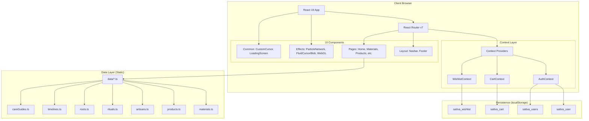
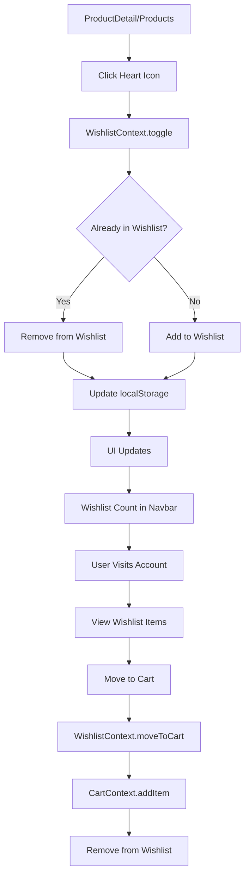
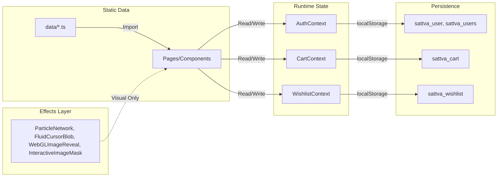
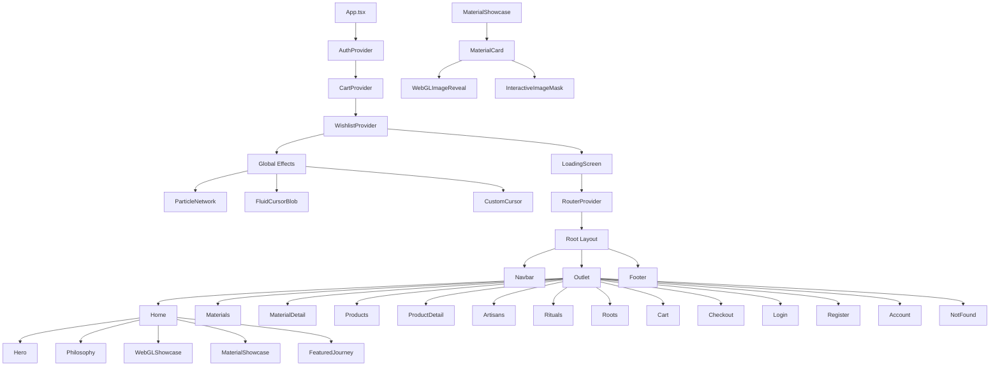

# Sattva Cloud Angadi - System Flowchart

## High-Level Architecture



## Routing Flow

```mermaid
flowchart TD
    A[App Entry] --> B[AuthProvider]
    B --> C[CartProvider]
    C --> D[WishlistProvider]
    D --> E[RouterProvider]
    
    E --> F{Root Layout}
    F --> G[Navbar]
    F --> H[Outlet]
    F --> I{Footer?}
    I -->|No| J[Login/Register/Roots]
    I -->|Yes| K[Other Pages]
    
    H --> L[Route Matching]
    L --> M[/ -> Home]
    L --> N[/materials -> Materials]
    L --> O[/materials/:slug -> MaterialDetail]
    L --> P[/products -> Products]
    L --> Q[/products/:slug -> ProductDetail]
    L --> R[/artisans -> Artisans]
    L --> S[/artisans/:id -> Artisans]
    L --> T[/rituals -> Rituals]
    L --> U[/rituals/:id -> Rituals]
    L --> V[/roots -> Roots]
    L --> W[/cart -> Cart]
    L --> X[/checkout -> Checkout]
    L --> Y[/login -> Login]
    L --> Z[/register -> Register]
    L --> AA[/account -> Account]
    L --> AB[* -> NotFound]
```

## User Journey Flows

### Browse & Discovery Flow
```mermaid
flowchart TD
    A[Landing on Home] --> B[Hero Section]
    B --> C[Philosophy Section]
    C --> D[WebGL Interactive Showcase]
    D --> E[Material Showcase Grid]
    E --> F[Featured Journey Steps]
    
    F --> G{User Action}
    G -->|Click Material| H[/materials/:slug]
    G -->|Click Product| I[/products/:slug]
    G -->|Explore Materials| J[/materials]
    G -->|Explore Products| K[/products]
    G -->|Begin Journey| J
    
    H --> L[MaterialDetail Page]
    L --> M[View Timeline]
    L --> N[View Products by Material]
    L --> O[Related Rituals]
    
    I --> P[ProductDetail Page]
    P --> Q[Add to Cart]
    P --> R[Add to Wishlist]
    P --> S[View Care Guide]
    P --> T[View Related Rituals]
```

### Shopping Flow
```mermaid
flowchart TD
    A[ProductDetail] --> B[Add to Cart]
    B --> C[CartContext.addItem]
    C --> D[Update localStorage]
    D --> E[Show Toast/Animation]
    
    E --> F{Continue Shopping?}
    F -->|Yes| G[Back to Products/Materials]
    F -->|No| H[Go to Cart]
    
    H --> I[Cart Page]
    I --> J[Review Items]
    J --> K[Update Quantity]
    K --> L[Remove Items]
    L --> M[Proceed to Checkout]
    
    M --> N{Logged In?}
    N -->|No| O[Login/Register Redirect]
    N -->|Yes| P[Checkout Page]
    
    O --> Q[Auth Flow]
    Q --> P
    
    P --> R[Fill Address]
    R --> S[Place Order]
    S --> T[AuthContext.addOrder]
    T --> U[CartContext.clearCart]
    U --> V[Order Confirmation]
    V --> W[/account]
```

### Authentication Flow
```mermaid
flowchart TD
    A[User Clicks Login/Register] --> B[/login or /register]
    B --> C[Form Submission]
    C --> D{AuthContext Method}
    D -->|Login| E[Find User in localStorage]
    D -->|Register| F[Check Email Exists]
    
    E --> G{Credentials Match?}
    G -->|Yes| H[Set User State]
    G -->|No| I[Show Error]
    
    F --> J{Email Available?}
    J -->|Yes| K[Create New User]
    J -->|No| I
    
    K --> H
    H --> L[Save to localStorage]
    L --> M[Redirect to Previous Page]
    
    M --> N[Navbar Updates]
    N --> O[Account Page Accessible]
```

### Wishlist Flow


## Data Flow Summary



## Component Hierarchy



## Key Interactions

| Trigger | Context Action | Persistence | UI Update |
|---------|---------------|-------------|-----------|
| Login | `AuthContext.login()` | `sattva_user` | Navbar, Protected Routes |
| Register | `AuthContext.register()` | `sattva_user`, `sattva_users` | Navbar, Account Access |
| Add to Cart | `CartContext.addItem()` | `sattva_cart` | Cart Count, Toast |
| Update Cart | `CartContext.updateQuantity()` | `sattva_cart` | Cart Total, Item Count |
| Toggle Wishlist | `WishlistContext.toggle()` | `sattva_wishlist` | Heart Icon, Count |
| Place Order | `AuthContext.addOrder()` + `CartContext.clearCart()` | `sattva_user`, `sattva_cart` | Order History, Empty Cart |
| View Product | `AuthContext.addRecentlyViewed()` | `sattva_user` | Recently Viewed Section |

## Technology Stack_Flow

```
User Request
    ↓
Vite Dev Server (Port 8443)
    ↓
index.html → main.tsx → App.tsx
    ↓
React 19 + React Router 7
    ↓
Context Providers (Auth, Cart, Wishlist)
    ↓
Route Matching → Page Components
    ↓
Data Imports (data/*.ts)
    ↓
Tailwind CSS v4 Styling
    ↓
Three.js/WebGL Effects
    ↓
localStorage Persistence
    ↓
Browser Render
```

This flowchart documents the complete system architecture, routing, user journeys, data flows, and component hierarchy for the Sattva Cloud Angadi e-commerce platform.